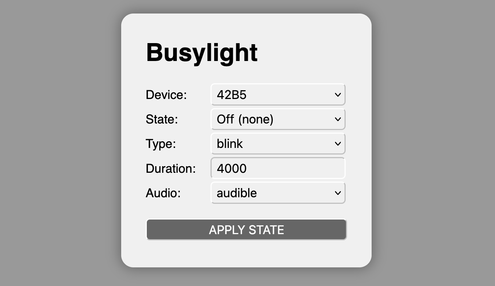

Busylight
=========

**Control Kuando Busylight through REST**

[](https://github.com/rse)
[](https://github.com/rse)

Abstract
--------

**Busylight** is a small REST service for controlling one or more of the neat
Plenom A/S [Kuando Busylight](https://busylight.com/) devices.
Internally it is based on a fork of the
[Busylight library](https://github.com/yaddran/busylight) (version 1.0.12 as of 2022)
in order to access the devices via USB from within Node.js. The **Busylight**
REST service is intended to be run on a small control host, like a [Raspberry Pi](https://www.raspberrypi.com/),
and accessed remotely from a control client like [Bitfocus Companion](https://bitfocus.io/companion).
For convenience reasons, a minimalistic Web UI is provided at the root path of the REST service
for interactively controlling the device.



Installation
------------

```
$ git clone https://github.com/rse/busylight
$ make build
$ make install
$ make start
$ make logs
```

Usage
-----

```
node busylight.js
    [-h|--help]
    [-v|--version]
    [-l|--log-level <level>]
    [-a|--http-addr <ip-address>]
    [-p|--http-port <tcp-port>]
    [-d|--device <device-name>:<device-serial>]
```

```
http://<ip-address>:<tcp-port>
    /<device-name>
    /{off,ok,info,warning,error}
    [/{steady,blink}
    [/{0,<duration>}
    [/quiet]]]
```

Example
-------

```
$ node busylight.js \
  -l INFO -a 0.0.0.0 -p 8080 \
  -d foo:382492FF000051FF24FFFFFF2802FFFF7002FFFF \
  -d bar:453092FF004071FF08FFFFFF8102FFFF9202FFFF
```

```
curl http://127.0.0.1:8080/foo/warning/blink/4000
```

Raspberry Pi 5 Setup
--------------------

- Purchase a [Raspberry Pi](https://www.raspberrypi.com/) (most easily with an all-in-one kit
  like the [GeeekPi Starter Kit für Raspberry Pi 5](https://www.amazon.de/dp/B0CSBVH8K9?ref=ppx_yo2ov_dt_b_fed_asin_title&th=1)) and
  install "Raspberry Pi OS Lite" (based on Debian 12.10)
  as the operating system (OS) onto it with the
  official [Raspberry Pi OS Imager](https://www.raspberrypi.com/software/).
  Pre-configure the Raspberry Pi OS with SSH access and a username/password
  during the imaging process. Then connect the device to the
  network, boot it and login with SSH.

- Upgrade the OS to latest Debian 12 version:

    ```
    sudo apt update
    sudo apt upgrade -y
    sudo apt autoremove --purge
    ```

- Install the essential tools:

    ```
    sudo apt install -y vim bash git make
    ```

- Upgrade the Raspberry Pi 5 firmware to the latest version:

    ```
    sudo rpi-update
    ```

- Underclock the Raspberry Pi 5 to reduce power consumption and heat:

    ```
    sudo vi /boot/firmware/config.txt
    | arm_boost=0
    | arm_freq=720
    ```

- Reduce services of Raspberry Pi OS:

    ```
    sudo systemctl disable avahi-daemon
    sudo systemctl disable bluetooth.service
    sudo systemctl disable ModemManager
    ```

- Install the latest Node.js 24 version:

    ```
    curl -fsSL https://deb.nodesource.com/setup_24.x -o nodesource_setup.sh
    sudo bash nodesource_setup.sh
    sudo apt-get install nodejs -y
    ```

- Install the Busylight service:

    ```
    cd $HOME
    git clone https://github.com/rse/busylight
    make build
    make install
    make start
    ```

- Configure system for non-network booting into console mode:

    ```
    sudo raspi-config nonint do_boot_wait 0
    sudo raspi-config nonint do_boot_behaviour B1
    ```

- Optionally configure WLAN:

    ```
    sudo raspi-config nonint do_wifi_country "<cc>"
    sudo raspi-config nonint do_wifi_ssid_passphrase "<ssid>" "<passphrase>"
    ```

- Optionally configure fixed IP addresses on Ethernet interface:

    ```
    sudo nmcli con mod "Wired connection 1" ipv4.addresses 10.1.0.94/24 \
        ipv4.gateway 10.1.0.1 ipv4.dns 10.1.0.1 ipv4.method manual
    sudo systemctl restart NetworkManager
    ```

    You can revert back to DHCP later with:

    ```
    sudo nmcli con mod "Wired connection 1" ipv4.method auto
    sudo systemctl restart NetworkManager
    ```

License
-------

Copyright &copy; 2025 Dr. Ralf S. Engelschall (http://engelschall.com/)<br/>
Licensed under [ISC](https://spdx.org/licenses/ISC)

